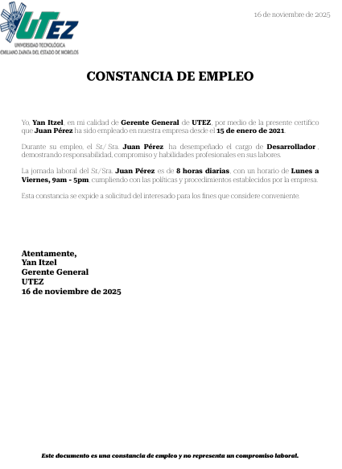

# Report Server

## Levantar el proyecto

### Backend
1. Entra a la carpeta `report-server`
2. Ejecuta `npm install` 
3. Ejecuta `npm run start:dev`

### Base de datos
1. Ejecuta `docker-compose up -d`

### Configurar pgAdmin
1. Ve a http://localhost:8080
2. Usa las credenciales:
   - **Email**: superman@google.com
   - **Password**: 123456

### Configurar servidor en pgAdmin
1. Una vez en pgAdmin, haz clic derecho en "Servers" → "Register" → "Server"
2. En la pestaña "General":
   - **Name**: `postgres_server`
3. En la pestaña "Connection":
   - **Host**: `postgres_database`
   - **Port**: `5433`
   - **Username**: `postgres`
   - **Password**: `123456`
4. Haz clic en "Save"

### Ejecutar SQL de inicialización
1. En pgAdmin, expande el servidor `postgres_server`
2. Haz clic derecho sobre la base de datos `postgres` → "Query Tool"
3. Abre el archivo `queries/01-employees.sql` y copia su contenido
4. Pega el SQL en el Query Tool y ejecútalo (F5 o botón play)

## Ejemplo de Reporte Generado

## Endpoints disponibles

- `GET /basic-reports/employment-letter/:id` - Constancia de empleo por ID

## Notas importantes

- El puerto 5433 se usa para evitar conflictos con PostgreSQL local en el puerto 5432
- La base de datos se crea automáticamente con el nombre `postgres` (base de datos por defecto)
- El contenedor de PostgreSQL expone el puerto 5433 en el host mapeado al 5432 del contenedor